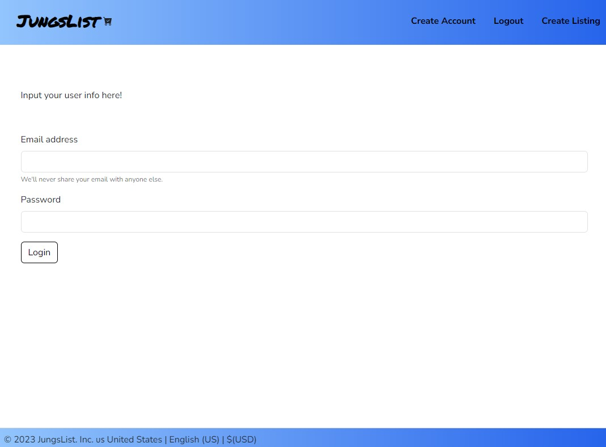
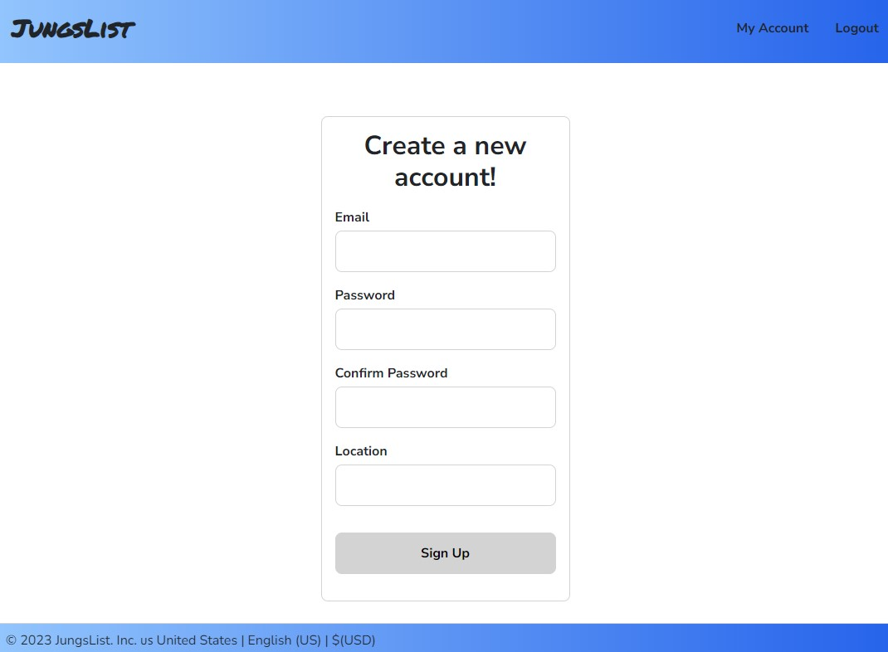
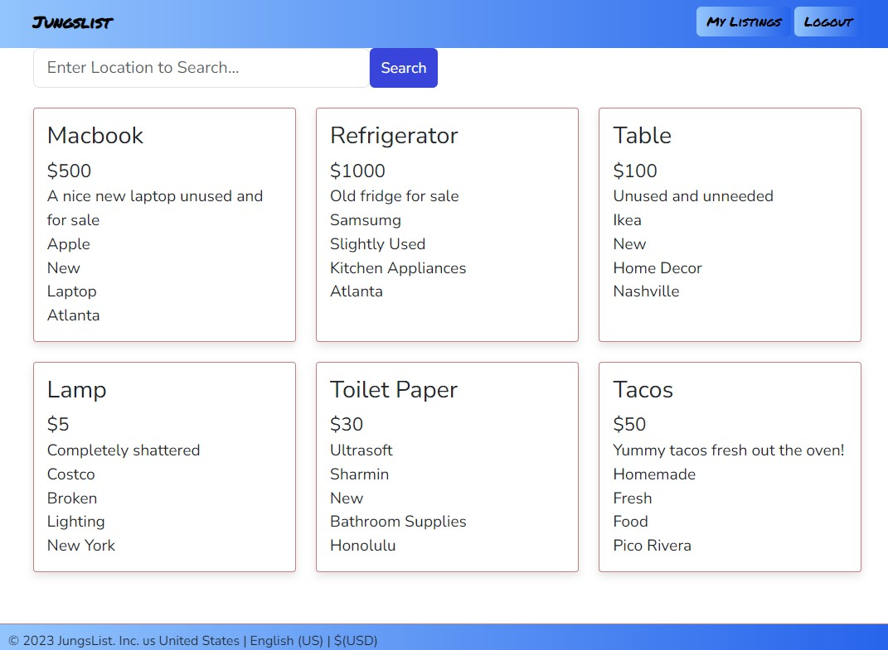
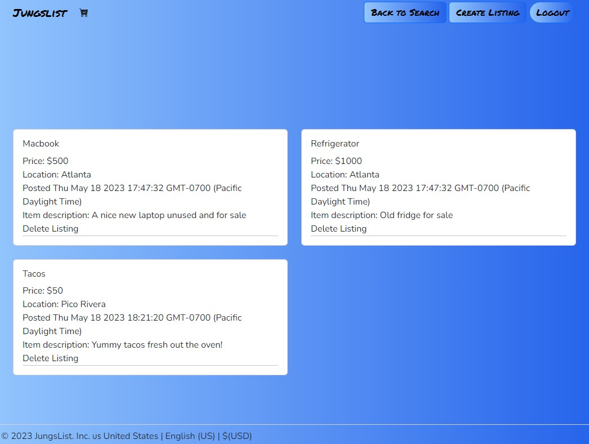

# Jungslist
  

  ## Description

  Jungslist is the go-to destination for buying, selling, and connecting with your local community. Our website offers a seamless and user-friendly platform where you can find a wide variety of items, services, and opportunities right at your fingertips.

  ## Table of Contents

  - [Installation](#installation)
  - [Usage](#usage)
  - [License](#license)
  - [Contributing](#contributing)
  - [Tests](#tests)
  - [Questions](#questions)

  ## Installation

  The project should be launched as a website at https://git.heroku.com/obscure-cliffs-55909.git.

  ## Usage

  Users will be prompted to enter their email and password before entering the website. 
  
  If the user does not have an account with us, they can easily create one by clicking 'Create Account'. 
  
  Upon successfully logging in, users can view listings of items created by others.
  
  Users can view and delete their own listings by clicking on 'My Listings'.
  
  Users can create listings by clicking 'Create Listing'.
  

  ## License

  Copyright (c) amalahema blee241 CoreyVesey Daisha22d Will-rd. All rights reserved.  
  Licensed under the [MIT License](https://opensource.org/licenses/MIT) license.
  
  ## Contributing

  Contribute by forking the repository and play with the code yourself!

  ## Tests

  Test the project by inputting different emails and listings.

  ## Questions
  
  Contact us on GitHub: amalahema blee241 CoreyVesey Daisha22d Will-rd  
  